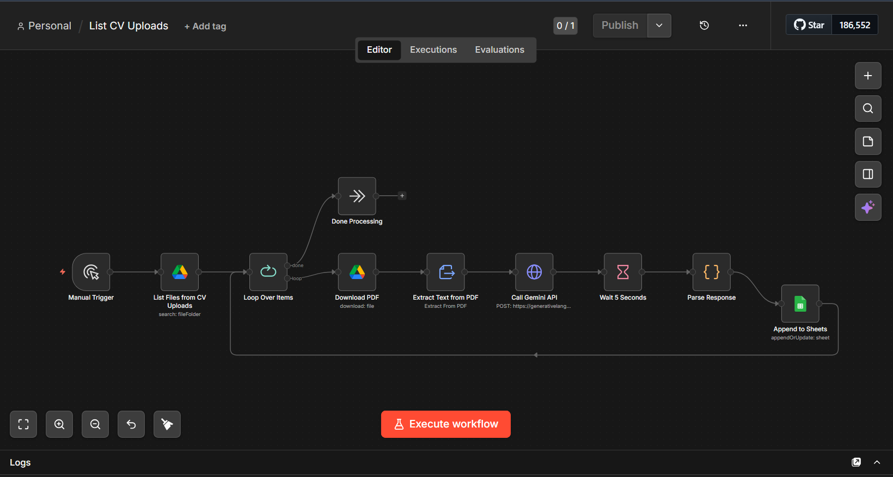

# Automated CV Screening Workflow

n8n pipeline that fetches CV PDFs from Google Drive, 
scores them against a role using Gemini 2.5 Flash, 
and outputs structured results to Google Sheets.

## What it does
- Fetches PDFs from a specified Google Drive folder
- Sends each CV to Gemini with a structured scoring prompt
- Extracts: match score, key skills, summary
- Writes timestamped results to Google Sheets
- Handles rate limits (5s delay, 15 req/min)
- Duplicate-safe — won't re-process existing entries

## Tech
- n8n (self-hosted or cloud)
- Google Gemini 2.5 Flash Lite
- Google Drive API
- Google Sheets API

## How to import
1. Open n8n
2. New Workflow → Import from file
3. Select `List CV Uploads.json`
4. Add your Google credentials
5. Set environment variable: `GEMINI_API_KEY`
6. Run

## Setup Credentials

### Gemini API Key
1. Get your API key from [Google AI Studio](https://aistudio.google.com/app/apikey)
2. Create a `.env` file in this directory:
   ```
   GEMINI_API_KEY=your_key_here
   ```
3. n8n will read this on workflow execution

### Google Drive & Sheets
Configure these OAuth2 credentials in n8n:
- Go to **Credentials** → New → Google Drive OAuth2 API
- Go to **Credentials** → New → Google Sheets OAuth2 API

Do NOT commit `.env` files or API keys to Git. Use `.env.example` as a template.

## Screenshot

